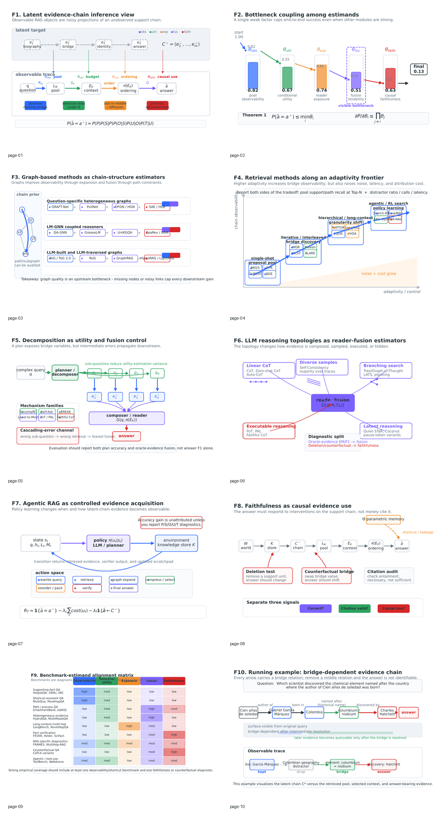

# Multi-Hop Retrieval-Augmented Reasoning Survey

> **A latent evidence-chain inference perspective on multi-hop RAG.**

[](MH_survey.pdf)
[](LICENSE)
[](MH_survey.pdf)

This repository is the living companion to the survey **“Multi-Hop Retrieval-Augmented Reasoning: A Latent Evidence-Chain Inference Perspective.”** It organizes multi-hop retrieval-augmented reasoning around the latent evidence chain that a system must recover and use, rather than around architecture alone.

The paper frames end-to-end success as five coupled bottlenecks:

| Estimand | Question it asks |
| --- | --- |
| **Observability** | Does the retrieved pool contain the needed support chain? |
| **Conditional utility** | Does budgeted selection preserve the useful evidence? |
| **Exposure** | Is the evidence accessible to the reader at the point of use? |
| **Fusion reliability** | Can the reader compose the evidence correctly? |
| **Causal faithfulness** | Did the generated answer actually depend on the evidence? |



## Paper

- [Read the manuscript (PDF)](MH_survey.pdf)
- Author: Yuqing Luo, University of Science and Technology of China
- Venue status: author manuscript draft, typeset with the ACM `acmart` class.

> The PDF currently contains placeholder publication metadata (including the DOI). It is **not** the ACM Version of Record. Replace this notice, the citation metadata, and any DOI links only after the publisher supplies the final bibliographic record.

## What is in this repository

```text
.
├── MH_survey.pdf                  # survey manuscript
├── taxonomy/                      # machine-readable, community-maintained catalog
├── docs/                          # taxonomy rules, roadmap, and change log
├── mh_figures/                    # rendered figures and generation source
├── scripts/                       # catalog utilities and validation
├── CITATION.cff                   # GitHub citation metadata
├── CONTRIBUTING.md                # how to propose catalog updates
└── LICENSE                        # license for repository-authored materials
```

The three catalog files deliberately separate methods, benchmarks, and method-to-pipeline mappings. Their stable schemas make it possible to review, filter, and extend the survey without changing prose in the PDF.

| File | Contents |
| --- | --- |
| [`taxonomy/methods.csv`](taxonomy/methods.csv) | Methods and analyses, tagged by architectural family and primary estimand |
| [`taxonomy/benchmarks.csv`](taxonomy/benchmarks.csv) | Benchmarks, observed diagnostics, and evaluation cautions |
| [`taxonomy/pipeline_mapping.csv`](taxonomy/pipeline_mapping.csv) | Which pipeline stage and estimand a method affects |
| [`taxonomy/reading_list.bib`](taxonomy/reading_list.bib) | BibTeX entries for catalogued work |

## Start here

1. Read [the taxonomy guide](docs/taxonomy.md) for the dual-axis annotation rules.
2. Browse the catalog files above, or filter them in a spreadsheet/dataframe.
3. Use the [reporting checklist](docs/reporting_checklist.md) when evaluating a multi-hop RAG system.
4. See [the roadmap](docs/roadmap.md) for planned catalog coverage and releases.

## Scope

We cover retrieval-grounded multi-hop reasoning over text, knowledge graphs, tables, and hybrid sources. The repository includes foundational components when they materially affect multi-hop evidence acquisition, selection, ordering, fusion, or verification. It does not aim to be a general survey of single-hop retrieval or general-purpose agents.

## Contributing

Corrections and additions are welcome, particularly newly published methods, overlooked benchmarks, reproducibility links, and taxonomy disagreements. Please follow [CONTRIBUTING.md](CONTRIBUTING.md), provide a stable paper URL or DOI, and explain the proposed estimand label.

For substantial taxonomy changes, open an issue first so that labels remain comparable across entries.

## Citation

Until a DOI and final venue record exist, cite this work as an unpublished manuscript:

```bibtex
@article{luo2026multihopragsurvey,
  author  = {Yuqing Luo},
  title   = {Multi-Hop Retrieval-Augmented Reasoning: A Latent Evidence-Chain Inference Perspective},
  year    = {2026},
  note    = {Manuscript draft. Repository companion: https://github.com/<YOUR-ORG-OR-USER>/multi-hop-rag-survey}
}
```

Please update both this entry and [`CITATION.cff`](CITATION.cff) from the publisher's final metadata when available.

## License and attribution

The repository-authored catalog, documentation, and utility code are released under the [MIT License](LICENSE). The manuscript and figures remain © 2026 Yuqing Luo, subject to the rights and publication terms shown in the manuscript. Do not treat the repository license as permission to redistribute a publisher's Version of Record.
