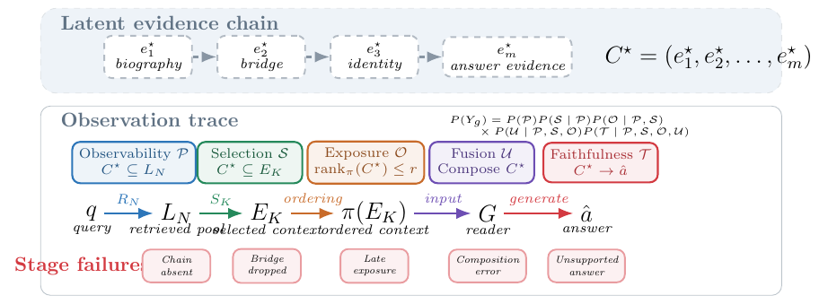

# Multi-Hop Retrieval-Augmented Generation through Evidence Chains

> **A diagnostic survey of multi-hop RAG through evidence-chain events.**

[](MH_survey.pdf)
[](LICENSE)
[](MH_survey.pdf)

This repository is the living companion to the survey **“Multi-Hop Retrieval-Augmented Generation through the Lens of Evidence Chains: A Diagnostic Survey.”** It organizes multi-hop retrieval-augmented generation around the evidence chain that a system must recover, preserve, expose, compose, and causally use, rather than around architecture alone.

> **Research hub:** the repository ships a filterable static catalog in [`docs/index.html`](docs/index.html). The included GitHub Pages workflow deploys it whenever GitHub Pages is enabled for this repository.

The paper frames end-to-end success as five coupled bottlenecks:

| Evidence-chain target | Question it asks |
| --- | --- |
| **Observability** | Does the retrieved pool contain the needed support chain? |
| **Selection preservation** | Does budgeted selection preserve a valid evidence chain? |
| **Exposure** | Is the evidence accessible to the reader at the point of use? |
| **Fusion reliability** | Can the reader compose the evidence correctly? |
| **Causal faithfulness** | Did the generated answer actually depend on the evidence? |



## Paper

- [Read the manuscript (PDF)](MH_survey.pdf)
- Authors: Yuqing Luo and Kai Zhang, University of Science and Technology of China
- Venue status: author manuscript draft, typeset with the ACM `acmart` class.

> The PDF currently contains placeholder publication metadata (including the DOI). It is **not** the ACM Version of Record. Replace this notice, the citation metadata, and any DOI links only after the publisher supplies the final bibliographic record.

## What is in this repository

```text
.
├── MH_survey.pdf                  # survey manuscript
├── taxonomy/                      # machine-readable, community-maintained catalog
├── docs/                          # taxonomy rules, roadmap, and change log
├── mh_figures/                    # rendered figures and generation source
├── scripts/                       # catalog utilities and validation
├── CITATION.cff                   # GitHub citation metadata
├── CONTRIBUTING.md                # how to propose catalog updates
└── LICENSE                        # license for repository-authored materials
```

The hub deliberately separates the **reviewed catalog** from the **imported full library**. Its stable schemas make it possible to review, filter, and extend the survey without changing prose in the PDF. The current catalog contains **23 method records**, **6 benchmark records**, and **27 intervention mappings**; the manuscript's frozen quantitative audit uses the **20 source-verified method records** and excludes discovery-only or needs-review entries. The imported library contains **229 deduplicated papers** awaiting per-record verification. This distinction is deliberate: coverage should not be confused with a taxonomy judgment.

| File | Contents |
| --- | --- |
| [`taxonomy/methods.csv`](taxonomy/methods.csv) | Methods and analyses, tagged by architectural family and primary evidence-chain target |
| [`taxonomy/benchmarks.csv`](taxonomy/benchmarks.csv) | Benchmarks, observed diagnostics, and evaluation cautions |
| [`taxonomy/pipeline_mapping.csv`](taxonomy/pipeline_mapping.csv) | Which pipeline stage and evidence-chain target a method affects |
| [`taxonomy/reading_list.bib`](taxonomy/reading_list.bib) | BibTeX entries for catalogued work |
| [`docs/index.html`](docs/index.html) | Filterable catalog interface, automatically built from the CSV catalog |
| [`docs/coverage_protocol.md`](docs/coverage_protocol.md) | Scope, discovery, verification, and correction rules |
| [`taxonomy/library_papers.csv`](taxonomy/library_papers.csv) | Full 229-paper import from the working literature library, with original folders and review state |
| [`taxonomy/discovery_queries.csv`](taxonomy/discovery_queries.csv) | Reproducible query families for maintaining a separate unreviewed candidate queue |
| [`docs/quantitative_audit.md`](docs/quantitative_audit.md) | Frozen seed counts used by the manuscript reporting audit |

## Literature navigator

The catalog is designed to be read as a map, not as an unstructured paper list. Start from either the bottleneck you want to solve or the system design you want to study:

| Navigate by research question | Navigate by design route |
| --- | --- |
| [Can the needed chain be found? — Observability](docs/literature_navigator.md#observability-find-the-support-chain) | [Dense / iterative retrieval](docs/literature_navigator.md#by-design-route) |
| [Which evidence survives the budget? — Selection preservation](docs/literature_navigator.md#selection-preservation-keep-a-valid-chain-under-budget) | [Graph and knowledge-grounded methods](docs/literature_navigator.md#by-design-route) |
| [Is evidence usable in context? — Exposure](docs/literature_navigator.md#exposure-make-evidence-usable-in-context) | [Reader and fusion architectures](docs/literature_navigator.md#by-design-route) |
| [Can the model compose evidence? — Fusion](docs/literature_navigator.md#fusion-compose-evidence-correctly) | [Reasoning-interleaved and agentic RAG](docs/literature_navigator.md#by-design-route) |
| [Did the answer rely on its evidence? — Faithfulness](docs/literature_navigator.md#faithfulness-and-joint-control) | [Context organization and hierarchical retrieval](docs/literature_navigator.md#by-design-route) |

- **New to multi-hop RAG?** Follow the [foundation-to-agentic reading path](docs/literature_navigator.md#suggested-reading-paths).
- **Looking for a specific paper?** Use the [chronological index](docs/literature_navigator.md#chronological-index) or open the machine-readable [methods catalog](taxonomy/methods.csv).
- **Adding a paper?** Follow the [annotation rules](docs/taxonomy.md) and [contribution guide](CONTRIBUTING.md).

## Start here

1. Read [the taxonomy guide](docs/taxonomy.md) for the dual-axis annotation rules.
2. Browse the catalog files above, or filter them in a spreadsheet/dataframe.
3. Use the [reporting checklist](docs/reporting_checklist.md) when evaluating a multi-hop RAG system.
4. See [the roadmap](docs/roadmap.md) for planned catalog coverage and releases.

## Scope

We cover retrieval-grounded multi-hop reasoning over text, knowledge graphs, tables, and hybrid sources. The repository includes foundational components when they materially affect multi-hop evidence acquisition, selection, ordering, fusion, or verification. It does not aim to be a general survey of single-hop retrieval or general-purpose agents.

## Contributing

Corrections and additions are welcome, particularly newly published methods, overlooked benchmarks, reproducibility links, and taxonomy disagreements. Please follow [CONTRIBUTING.md](CONTRIBUTING.md), provide a stable paper URL or DOI, and explain the proposed evidence-chain target label.

For substantial taxonomy changes, open an issue first so that labels remain comparable across entries.

## Citation

Until a DOI and final venue record exist, cite this work as an unpublished manuscript:

```bibtex
@article{luo2026multihopragsurvey,
  author  = {Yuqing Luo and Kai Zhang},
  title   = {Multi-Hop Retrieval-Augmented Generation through the Lens of Evidence Chains: A Diagnostic Survey},
  year    = {2026},
  note    = {Manuscript draft. Repository companion: https://github.com/TsingyuL/multi-hop-rag-survey}
}
```

Please update both this entry and [`CITATION.cff`](CITATION.cff) from the publisher's final metadata when available.

## License and attribution

The repository-authored catalog, documentation, and utility code are released under the [MIT License](LICENSE). The manuscript and figures remain © 2026 Yuqing Luo, subject to the rights and publication terms shown in the manuscript. Do not treat the repository license as permission to redistribute a publisher's Version of Record.
